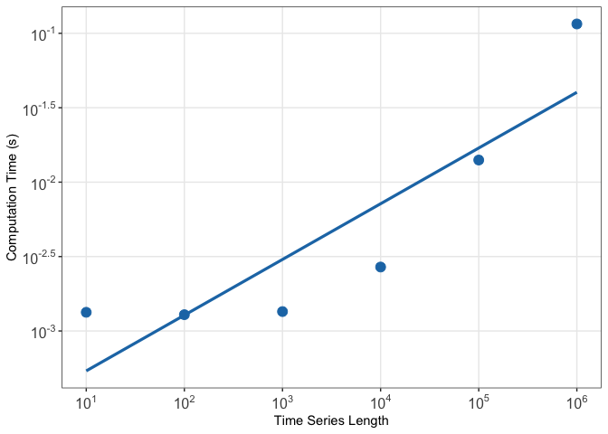

# tsCeatures 

R package for computation of some simple time-series features coded in
C++ for efficiency and scalability.

The package name is a play on the `tsfeatures` naming convention in the
time series software world and should not be taken seriously.

## Installation

You can install the development version of `tsCeatures` from GitHub
using the following:

``` r
devtools::install_github("hendersontrent/tsCeatures")
```

## Computational performance

With features coded in C++, `tsCeatures` is highly computationally
efficient. Computation time in seconds (log10 scaled) for a range of
time-series lengths between `t = 10` and `t = 1000000` is presented
below.

<!-- -->

## Notes

This package is a pretty low-fi and informal attempt at something
interesting and is not intended as-yet to be a dedicated and useful
feature set relative to existing sets and software packages.
